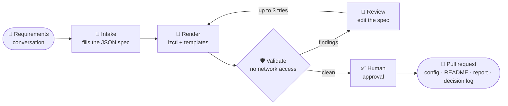

<div align="center">

# 🏗️ Terraform Landing Zone Template Skill

### The goal: from a requirements conversation to a review-ready landing zone PR.

A portable **Agent Skill** plus a hosted **ADK agent on Cloud Run** that turns landing zone requirements into validated Terraform for **GCP, Azure, AWS or OpenStack**, delivered as a GitHub pull request.

[](docs/DESIGN.md#delivery-plan-and-milestones)
[](LICENSE)
[](https://github.com/loriamichaelj/terraform-landing-zone-template-skill/actions/workflows/ci-skill.yml)
[](https://github.com/loriamichaelj/terraform-landing-zone-template-skill/actions/workflows/ops-oidc-check.yml)

[](https://developer.hashicorp.com/terraform)
[](https://github.com/GoogleCloudPlatform/cloud-foundation-fabric)
[](https://azure.github.io/Azure-Verified-Modules/)
[](https://docs.aws.amazon.com/controltower/latest/userguide/aft-overview.html)
[](https://registry.terraform.io/providers/terraform-provider-openstack/openstack/latest)
[](https://agentskills.io)
[](https://adk.dev/2.0/)
[](CONTRIBUTING.md)
[](https://github.com/loriamichaelj/terraform-landing-zone-template-skill/discussions)

[**Design**](docs/DESIGN.md) · [**Decisions**](docs/ADR.md) · [**CI/CD**](docs/CICD.md) · [**Contributing**](CONTRIBUTING.md) · [**Discussions**](https://github.com/loriamichaelj/terraform-landing-zone-template-skill/discussions)

</div>

---

## 💡 Why

Standing up a compliant landing zone takes **weeks of senior platform time**, mostly translating requirements into hundreds of module settings. The reference foundations are solid, but teams misconfigure them in predictable ways, and policy violations surface late.

LLMs are great at intake and terrible at writing reviewable infrastructure code from scratch. This project leans on the first and guards against the second:

> **The model picks values. Templates decide structure. Humans approve. The pipeline applies.**

## ✨ Highlights

<table>
<tr>
<td width="50%" valign="top">

### 🧱 Vetted baselines only
Composes **Fabric FAST**, **Azure Verified Modules** and **Control Tower + AFT**, and fills in their configuration. **No freeform HCL. Ever.**

</td>
<td width="50%" valign="top">

### 🎯 Deterministic output
`lzctl` renders templates with **no model in the loop**. Same spec + same skill version = **byte-identical output** on every host.

</td>
</tr>
<tr>
<td valign="top">

### 🛡️ Validated before you see it
fmt · validate · tflint · trivy · checkov · OPA policies · upstream schemas, in an **isolated job with no network access**. Failures are fixed in the spec, not the code.

</td>
<td valign="top">

### 🔒 Blast radius: one pull request
The agent **never runs `terraform apply`** and holds no org-level credentials. Merges need code-owner approval; apply runs in your existing pipeline.

</td>
</tr>
<tr>
<td valign="top">

### 🧳 Runs where you work
One `SKILL.md` package for **Codex**, **Gemini CLI**, **Grok Build**, **DeepSeek-backed hosts** and the hosted agent.

</td>
<td valign="top">

### 📜 Every choice explained
Each PR ships with a **decision log**: every non-default value records who chose it and why.

</td>
</tr>
</table>

## ⚙️ How it works



| Step | What happens |
| --- | --- |
| 📝 **Intake** | A conversation fills a landing zone spec, checked against a schema derived from the baseline. Missing mandatory fields get follow-up questions. |
| 🧩 **Render** | `lzctl` turns the spec into configuration data (FAST YAML datasets, tfvars) from templates. |
| 🛡️ **Validate** | Static checks and policy-as-code run in an isolated job. Each finding maps back to the spec field that caused it. |
| 🔧 **Review** | The spec is fixed and re-rendered, at most 3 times; then the findings go to you. |
| 🚀 **Publish** | After you approve, a PR opens with the config, a README, the validation report and the decision log. |

## ☁️ Clouds and profiles

| Cloud | Baseline | Hierarchy |
| --- | --- | --- |
|  | Cloud Foundation Fabric FAST (YAML datasets) | Organization › folders › projects |
|  | AVM for Platform Landing Zones | Tenant root › management groups › subscriptions |
|  | Control Tower + AFT + SCPs | Organization › OUs › accounts |
|  | Our own module set | Domains › projects |

| Profile | For | Adds |
| --- | --- | --- |
| 🌱 **Starter** | Sandboxes, proofs of concept | Hierarchy, one environment, central logging, budgets |
| 🏢 **Standard** *(default)* | Most enterprise workloads | dev/stage/prod, hub-and-spoke network, guardrails, IAM groups, 1-year audit logs |
| 🏦 **Regulated** | SOC 2, PCI-DSS, HIPAA scope | Customer-managed keys, private-only access, service perimeters, stricter policy pack, break-glass |

## 🚀 Try it

Today's slice runs locally: validate a spec, render the GCP `0-org-setup` dataset from it, then check the output. It needs Python 3.11+.

```bash
pip install -r tests/requirements.txt
S=.agents/skills/landing-zone/scripts/lzctl

$S doctor                                                    # check dependencies
$S spec validate evals/gcp/valid/standard.spec.json          # findings name the spec field to fix
$S render evals/gcp/valid/standard.spec.json --out /tmp/lz   # FAST dataset + render-report.json
$S check /tmp/lz                                             # integrity, upstream schemas, terraform fmt, scans
$S explain /tmp/lz                                           # trace any finding back to a spec field
python -m pytest tests                                       # unit and render tests
```

`render` covers the hierarchy, environments, audit logging and, for a hub-and-spoke spec with peering, the `2-networking` stage (a hub VPC, one spoke per environment and a deterministic CIDR plan). Security, the other hub connectivity options, the single-VPC topology and the Regulated profile are not rendered yet, and every render lists the spec fields it left out (`not_rendered_yet`). See [ADR-020](docs/ADR.md#adr-020-gcp-output-is-a-vendored-fast-dataset-plus-overlay-templates) and [ADR-024](docs/ADR.md#adr-024-the-2-networking-stage-is-rendered-from-the-peering-dataset-with-a-fixed-cidr-plan).

## 🗺️ Roadmap

- [x] **Design:** architecture, spec schema, cost model, 24 ADRs
- [x] **CI foundation:** OIDC per GitHub environment, Terraform state, Secret Manager + KMS, environment folders
- [x] **Community:** license, contributing guide, issue forms, Discussions, protected `dev` branch
- [ ] **P0, core + GCP:** spec schema ✓, `lzctl` (validate, render, check, explain ✓), validator image, eval harness, FAST datasets (`0-org-setup` ✓, `2-networking` with peering ✓; security next)
- [ ] **P1, hosted agent:** ADK 2.0 workflow on Cloud Run, PR flow, first pilot
- [ ] **P2, Azure, AWS, hosts:** AVM ALZ and Control Tower/AFT baselines, host compatibility matrix
- [ ] **P3, OpenStack + hardening:** OpenStack modules, sandbox plans, security review

Phases are gated, not dated: each starts when the previous gate passes. Details in the [delivery plan](docs/DESIGN.md#delivery-plan-and-milestones).

## 📚 Docs

| | Doc | What it covers |
| --- | --- | --- |
| 🏛️ | [DESIGN.md](docs/DESIGN.md) | Architecture, spec schema, baselines, security, cost estimate, delivery plan |
| 🧭 | [ADR.md](docs/ADR.md) | Architecture decision records and review log |
| 🔁 | [CICD.md](docs/CICD.md) | Branches, environments, workflow inventory, naming conventions, actions policy |
| 🧩 | [Skill package](.agents/skills/landing-zone/SKILL.md) | The `SKILL.md` workflow, spec fields and the GCP baseline reference, as agents read them |
| 🔑 | [State bucket and OIDC](docs/runbooks/gcp-state-bucket-and-github-oidc.md) | GitHub Actions to GCP without keys (the GCP equivalent of an AWS OIDC role) |
| 🤫 | [Secrets](docs/runbooks/secrets.md) | Secret Manager with a KMS key, and GitHub environment secrets |

<details>
<summary><b>🔧 GCP and GitHub environment reference</b></summary>

<br/>

| Item | Value |
| --- | --- |
| Organization | `mikejloria-org` |
| Folders | `dev`, `stage`, `prod` at the org root, tagged `environment:dev` / `stage` / `prod` (`stage` and `prod` empty for now) |
| Project | `skills-mjl-27850`, in the `dev` folder, tagged `environment:dev` |
| Region | `us-central1` |
| Terraform state | `gs://skills-mjl-27850-tlz-tfstate`, one prefix per environment |
| OIDC provider | `projects/853750160087/locations/global/workloadIdentityPools/github/providers/github-actions` |
| Secrets | Secret Manager, encrypted with KMS key `tlz/secret-manager` |

| GitHub environment | Service account | Can read secrets named |
| --- | --- | --- |
| `bootstrap` | `lz-bootstrap-sa` | `bootstrap-*` |
| `dev` | `lz-dev-sa` | `dev-*` |

Each environment has `GCP_WORKLOAD_IDENTITY_PROVIDER`, `GCP_SERVICE_ACCOUNT`, `TF_STATE_BUCKET` and `TF_STATE_PREFIX`. A job must declare `environment:` to reach GCP, and no GCP keys are stored in GitHub. Check the setup any time:

```bash
gh workflow run ops-oidc-check.yml -f environment=dev
```

**Conventions:** every resource this repo creates carries the tag `skills-mjl-27850/name/Terraform-Landing-Zone-Template-Skill` ([ADR-012](docs/ADR.md#adr-012-tag-every-resource-this-repo-creates)); folders, projects and every taggable resource also carry the org-level `environment` tag ([ADR-017](docs/ADR.md#adr-017-environment-folders-and-the-environment-tag), [ADR-019](docs/ADR.md#adr-019-every-taggable-resource-carries-both-the-name-and-environment-tags)). `dev` accepts changes only through reviewed pull requests; only the repo admin can push directly ([ADR-018](docs/ADR.md#adr-018-dev-accepts-changes-only-by-pull-request-except-the-owner)).

</details>

## 🤝 Contributing

The design is settled enough to build on and still open to change: P0 is under way, and only the GCP `0-org-setup` slice renders so far. **Design review and cloud expertise are especially welcome**: Azure ALZ, AWS Control Tower and OpenStack gotchas, spec schema critiques, and answers to the open questions at the end of each doc.

| I want to… | Go to |
| --- | --- |
| 💬 Ask a question or share an idea | [Discussions](https://github.com/loriamichaelj/terraform-landing-zone-template-skill/discussions) |
| 🐛 Report a bug, request a feature, propose a design change | [New issue](https://github.com/loriamichaelj/terraform-landing-zone-template-skill/issues/new/choose) |
| 🛠️ Send a change | [CONTRIBUTING.md](CONTRIBUTING.md): branch from `dev`, Conventional Commits PR title, one code-owner approval, squash-merged |
| 🔐 Report a vulnerability | Privately, per [SECURITY.md](SECURITY.md) |

Please follow the [Code of Conduct](CODE_OF_CONDUCT.md). Need help? See [SUPPORT.md](SUPPORT.md).

## 📄 License

Licensed under the [Apache License 2.0](LICENSE).

<div align="center">
<sub>Built on the shoulders of Cloud Foundation Fabric, Azure Verified Modules, AWS Control Tower and the open Agent Skills format.</sub>
<br/><br/>
⭐ <b>Star the repo</b> to follow along as the build begins.
</div>
