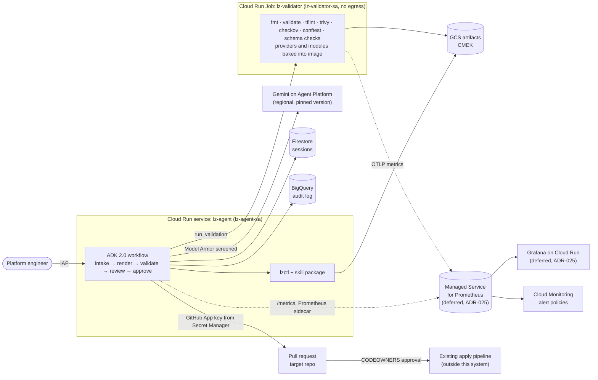

# Design Doc: Terraform Landing Zone Agent (ADK on Cloud Run)

Oct 7, 2026 · Author: M.L. · Last reviewed: Oct 8, 2026 (see [ADR.md](ADR.md) for decisions and change history)

## Overview

We will build a portable Agent Skill, plus a hosted ADK agent on Cloud Run, that turns landing zone requirements into a validated Terraform landing zone for GCP, Azure, AWS or OpenStack, delivered as a GitHub pull request. The agent composes vetted modules and fills in their configuration data; it never writes freeform HCL and never runs `terraform apply`.

Domain knowledge (module catalog, naming standards, policy rules) ships as a portable Agent Skill (`SKILL.md` package, [agentskills.io](https://agentskills.io) format), versioned separately from the agent runtime. The same skill runs in Codex, Gemini CLI, Grok Build and DeepSeek-backed hosts, as well as in the hosted agent.

| Field | Value |
| --- | --- |
| Status | Draft |
| Author | M.L. |
| Reviewers | Platform engineering, Cloud security, SRE (names TBD) |
| Target platform | Hosted agent on Google Cloud (Cloud Run, ADK 2.0, Gemini Enterprise Agent Platform); skill also runs locally in Codex, Gemini CLI, Grok Build and DeepSeek-backed hosts |
| MVP scope | GCP first, then Azure, AWS and OpenStack; Starter, Standard and Regulated profiles; PR output, validate-only (no plan, no apply) |

## Background and problem statement

Standing up a compliant GCP landing zone takes weeks of senior platform time, and most of it is translating requirements into module configuration. The reference foundations (Cloud Foundation Fabric FAST, `terraform-example-foundation`) are solid, but they expose hundreds of settings across stages, and teams misconfigure them in predictable ways.

The pain points this project targets:

- **Slow intake.** Requirements arrive as meeting notes and spreadsheets, not as a structured spec.
- **Inconsistent output.** Each engineer configures the foundation differently: naming, CIDR plans, log sinks, org policies.
- **Late feedback.** Policy and security violations surface in review or at apply time, after hours of work.
- **No audit trail** of why a configuration choice was made.

LLMs are good at intake and mapping intent to options, and bad at producing reviewable infrastructure code from scratch. The design leans on the first and guards against the second.

## Goals and non-goals

The MVP succeeds when a platform engineer can go from a requirements conversation to a review-ready landing zone PR in under one hour, with zero critical policy violations.

**Goals**

1. Convert conversational requirements into a schema-validated landing zone spec (JSON).
2. Render that spec into configuration data (YAML factory datasets and tfvars) for one pinned baseline per target cloud: GCP, Azure, AWS or OpenStack.
3. Validate every output with static checks and policy-as-code before a human sees it.
4. Deliver a PR containing the config, a README, a validation report and a decision log.
5. Ship the domain knowledge as a reusable Agent Skill, versioned independently of the agent, that runs in Codex, Gemini CLI, Grok Build and DeepSeek-backed hosts.
6. Run the agent itself on infrastructure that meets the same standards it generates.

**Non-goals (MVP)**

- Running `terraform apply`, or holding any org-level write credentials.
- Running `terraform plan` against a real organization (phase 3, sandbox org only).
- Freeform HCL authoring or new module development.
- Mixing clouds in one run: one spec targets one cloud; a multi-cloud estate is several specs.
- Day-2 operations: drift detection, upgrades, or tenant onboarding.
- Prometheus and Grafana inside the landing zones the agent generates. They monitor this system's own platform only (ADR-025).

## Requirements

Functional requirements define what the agent produces; non-functional requirements are the bar it must clear before any team relies on it.

**Functional**

| ID | Requirement |
| --- | --- |
| F1 | Collect requirements by conversation and ask follow-up questions for missing mandatory fields |
| F2 | Emit a landing zone spec that validates against a JSON schema derived from the baseline's own schemas and module variables |
| F3 | Let the user choose a target cloud (GCP, Azure, AWS, OpenStack) and a profile (Starter, Standard, Regulated); cover hierarchy, identity, network and CIDR plan, guardrails, logging and audit, keys and cost controls per the capability mapping |
| F4 | Render configuration data (YAML datasets, tfvars) from templates only, through the bundled `lzctl` CLI, so every host produces identical output; no freeform HCL |
| F5 | Run fmt, validate, lint, security scan, OPA policy checks and upstream schema checks on every render |
| F6 | Self-correct failed validations up to a fixed retry limit, then stop and report |
| F7 | Open a PR through a GitHub App with config, README, validation report and decision log |
| F8 | Support resuming a session and revising a spec after review comments |

**Non-functional**

| Area | Requirement |
| --- | --- |
| Security | No org-level credentials in the agent; validator isolated from secrets and network; all access authenticated (IAP or IAM) |
| Auditability | Every run records spec, output hash, model version and skill version to an append-only log |
| Determinism | Same spec plus same skill version renders byte-identical output |
| Latency | p95 end-to-end under 5 minutes from confirmed spec to PR (target; validate in P1) |
| Cost | Token and compute cost per run tracked and reported per team |
| Cost cap | The project stays under $20 a month: a billing budget alerts at 50, 75, 90 and 100%, and the hosted agent refuses new runs once the month's model spend reaches its $14 token budget (ADR-026) |
| Observability | Every run writes a structured run record (outcome, duration, findings, tokens, model and skill versions) that the SLIs below can be computed from. Prometheus metrics, Grafana dashboards and burn-rate alerts are scoped but deferred (ADR-025); when built, metric labels never carry requirements content |
| Data residency | All storage and model calls pinned to approved regions |
| Encryption | CMEK on storage holding specs, artifacts and logs |

## Proposed architecture

One Cloud Run service hosts the ADK agent; everything with side effects sits behind a narrow tool and its own identity.



The validator runs as a separate job so untrusted generated code never shares an identity or network path with the agent. The agent's reach ends at the pull request: merge needs CODEOWNERS approval, and apply runs only in the existing pipeline.

## Agent design

The agent is an ADK 2.0 graph workflow: deterministic nodes for everything that must behave the same every time, and LLM nodes only where judgment is needed. The skill supplies the knowledge; the workflow supplies control flow and guardrails.

**Skill package (`.agents/skills/landing-zone/`)**

```
SKILL.md                  # when to use, workflow, hard rules (host-neutral)
references/
  common.md               # spec fields, profiles, naming standards
  gcp.md azure.md aws.md openstack.md   # baseline, module catalog, gotchas
schemas/
  lz-spec.core.schema.json
  lz-spec.<cloud>.schema.json
templates/<cloud>/fast-<tag>/   # per baseline (ADR-020):
  upstream/               #   verbatim pinned copy: dataset, JSON schemas, license
  overlay/                #   Jinja templates that replace or add spec-driven files
  MANIFEST.json           #   tag, commit and SHA-256 of every upstream file
policies/<cloud>/         # Rego rules used by conftest (not written yet)
scripts/lzctl             # spec validate, render, check, explain, doctor
```

Golden specs and render hashes live outside the package, in the repo's `evals/` (see Repository layout), so the skill ships without test data.

**Workflow nodes**

| Node | Type | Responsibility | Tools |
| --- | --- | --- | --- |
| Intake | LLM (Gemini 3 Flash) | Interviews the user, fills the spec, asks for missing mandatory fields | `validate_spec` (JSON schema) |
| Render | Deterministic | Renders the spec into configuration data via templates | `lzctl render`, `lookup_module_catalog` |
| Validate | Deterministic | Triggers the validator job and returns structured findings | `run_validation` |
| Review | LLM (Gemini 3.1 Pro) | Maps each finding to a spec field and proposes a spec edit | `lzctl explain`, `diff_outputs` |
| Approve | Human-in-the-loop | User confirms the spec and validation report | none |
| Publish | Deterministic | Opens the pull request | `open_pull_request` |

`open_pull_request` is reachable only through the Approve node, after validation passes.

**Self-correction loop**

1. Render produces output from the spec.
2. Validate runs the validator job and returns structured findings.
3. Review maps each finding back to a spec field and proposes an edit; the workflow re-renders.
4. The loop is a workflow edge with a hard limit of 3 iterations. On the third failure, the workflow stops and hands the findings to the user.

The Review node edits the spec, never the rendered output. That keeps every fix traceable to a field and keeps rendering deterministic. Because the loop limit and the approval gate live in the workflow graph rather than in a prompt, a model cannot talk its way past them.

**Session state** uses the ADK session service backed by Firestore, so a reviewer can return to a run days later and revise it. ADK 2.0 changed the session schema; pin ADK at 2.x and do not share a session store with 1.x agents.

## Template strategy and spec schema

The LLM decides values; templates decide structure. Generated output is limited to configuration data for one pinned baseline, so reviewers diff configuration, not code.

**Rules**

- One pinned baseline per cloud per skill version (see Landing zone template configurations).
- The spec schema is meant to be generated from the baseline's own JSON schemas where they exist (Fabric FAST ships schemas for every factory file) and from module `variables.tf` otherwise, so hallucinated inputs fail schema validation before rendering. Today it is handwritten, with unknown fields rejected; generation is planned.
- Rendered output is validated again against the upstream schemas, which catches template bugs as well as spec bugs. The test suite does this for every rendered YAML file, and `lzctl check` does it at run time (ADR-021).
- Templates are plain Jinja with no LLM in the render path, which makes rendering deterministic and unit-testable. For GCP the templates are overlays on a vendored copy of the pinned FAST dataset (ADR-020).
- Bumping the baseline version requires a skill release and a full eval run.

**Spec shape (abridged)**

Core fields are cloud-agnostic. Settings with no cross-cloud equivalent live under `extensions.<cloud>`, and only the block matching `target.cloud` is allowed.

```json
{
  "spec_version": "2.0",
  "target": { "cloud": "gcp | azure | aws | openstack", "profile": "starter | standard | regulated", "baseline_version": "string" },
  "organization": { "id": "string", "billing_ref": "string", "domain": "string" },
  "hierarchy": { "environments": ["dev", "stage", "prod"], "business_units": ["string"] },
  "network": {
    "topology": "single | hub_spoke",
    "regions": ["string"],
    "cidr_supernet": "10.0.0.0/8",
    "private_service_access": true
  },
  "security": {
    "service_perimeter": false,
    "customer_managed_keys": true,
    "compliance": ["soc2", "pci"]
  },
  "logging": { "audit_destination": "analytics | archive | both", "retention_days": 400 },
  "iam": { "groups": { "org_admins": "email", "network_admins": "email", "security_admins": "email" } },
  "extensions": {
    "gcp": {
      "customer_id": "string",
      "prefix": "string",
      "hub_connectivity": "peering | ncc | nva | vpn",
      "audit_sink": "bigquery | gcs | both"
    }
  },
  "decisions": [{ "field": "string", "value": "any", "rationale": "string", "source": "user | default" }]
}
```

The guardrail set is not a separate field: it follows from `target.profile` (see Profiles). The `decisions` array becomes the PR's decision log: every non-default value records who chose it and why.

## Landing zone template configurations

The user picks a target cloud and a profile; the skill maps one cloud-agnostic spec onto a pinned baseline for that cloud. GCP, Azure and AWS ride vendor-maintained baselines; OpenStack has none, so we own its module set.

**Target clouds and baselines**

| Cloud | Baseline (pinned) | Rendered output | Terraform provider | Hierarchy | Notes |
| --- | --- | --- | --- | --- | --- |
| GCP | Cloud Foundation Fabric FAST, pinned by release tag (v59.0.0 at time of writing; alt: `terraform-example-foundation`) | YAML datasets for `0-org-setup`, `2-networking`, `2-project-factory`; small tfvars (`factories_config`, `context`) | `google` | Organization > folders > projects | FAST stages are now YAML-factory driven; major releases carry breaking changes |
| Azure | AVM for Platform Landing Zones: `avm-ptn-alz`, `avm-ptn-alz-management`, hub-and-spoke or Virtual WAN connectivity modules | tfvars | `azurerm` / `azapi` | Tenant root > management groups > subscriptions | Do not target the classic `caf-enterprise-scale` module: archived August 1, 2026 |
| AWS | Control Tower landing zone + Account Factory for Terraform (AFT) + Organizations SCPs | AFT account requests, SCP documents, tfvars | `aws` | Organization > OUs > accounts | Landing Zone Accelerator is CDK/config-driven, not Terraform; we generate AFT account requests and SCPs |
| OpenStack | Our own module set on `terraform-provider-openstack` | tfvars | `openstack` | Domain > projects (Keystone) | No vendor reference; capabilities vary by deployment (Octavia, Barbican, Designate may be absent) |

**Profiles**

| Profile | Use case | What it adds | GCP (FAST) mapping |
| --- | --- | --- | --- |
| Starter | Sandbox, proof of concept | Hierarchy, one environment, single network, central logging, budgets | `classic` dataset, trimmed to one environment (upstream `minimal` is still TBD in v59.0.0) |
| Standard (default) | Most enterprise workloads | dev/stage/prod, hub-and-spoke network, baseline guardrails, IAM groups, cost labels, audit log retention 1 year | `classic` dataset |
| Regulated | SOC 2, PCI-DSS, HIPAA scope | Standard plus customer-managed keys, private-only service access, service perimeter or preventive SCPs, stricter policy pack, break-glass accounts, longer log retention | `hardened` dataset plus `1-vpcsc` and `2-security`; its detective controls need SCC Premium or Enterprise |

**Capability mapping**

Every spec field maps to one construct per cloud. A capability a cloud cannot provide is rejected at spec validation, not discovered at apply.

| Capability | GCP | Azure | AWS | OpenStack |
| --- | --- | --- | --- | --- |
| Hierarchy | Folders, projects | Management groups, subscriptions | OUs, accounts | Domains, projects |
| Identity and access | Cloud Identity groups, IAM | Entra ID groups, Azure RBAC | IAM Identity Center, permission sets | Keystone roles, groups |
| Network topology | Hub-and-spoke VPCs via peering, NCC, NVA or HA VPN (FAST `2-networking` datasets) | Hub-and-spoke VNet or Virtual WAN | Transit Gateway, shared VPCs via RAM | Neutron networks, routers |
| Private service access | Private Service Connect | Private Endpoints | VPC endpoints (PrivateLink) | Provider networks (deployment-specific) |
| Central logging and audit | Org log sinks to BigQuery/GCS | Log Analytics, diagnostic settings | CloudTrail org trail, log archive account | Deployment-specific; usually external SIEM |
| Guardrails | Org policies, custom constraints, VPC-SC | Azure Policy (ALZ archetypes) | SCPs, Control Tower controls | Quotas, policy.yaml (operator-managed) |
| Key management | Cloud KMS (CMEK) | Key Vault, managed HSM | AWS KMS | Barbican (if deployed) |
| Cost controls | Budgets, labels | Budgets, tags | Budgets, tags, cost categories | Quotas only |

## Skill portability across agent hosts

One skill directory runs unchanged in Codex, Gemini CLI and Grok Build, because all of them read the open Agent Skills (`SKILL.md`) format. DeepSeek had no official coding harness as of October 2026 (a harness team was being hired in May 2026), so it runs through a `SKILL.md`-compatible host.

**Design change: deterministic work moves into a bundled CLI.** Every host model is different, so anything that must behave identically lives in `scripts/lzctl` (Python), not in model reasoning. The model's job shrinks to intake, field selection and explaining findings.

| Command | Does |
| --- | --- |
| `lzctl spec validate` | Checks the spec against the per-cloud JSON schema |
| `lzctl render <spec> --out <dir>` | Renders a spec to YAML datasets and tfvars, plus a report with file hashes and the fields not rendered yet |
| `lzctl check <dir>` | Verifies a rendered directory and emits JSON findings. Today: file integrity against the render report, upstream schema checks and `terraform fmt`. Trivy and Checkov scan rendered `.tf` files and are `not_applicable` until some exist (ADR-022). Validate, tflint and conftest are `not_applicable` until HCL and a policy pack are rendered (ADR-021) |
| `lzctl explain [dir] [--findings file]` | Maps findings from `check` or `spec validate` back to the spec fields that caused them, using the `sources` map in the render report. A finding on a hand-edited file is blamed on the edit, and one on an untouched upstream file is not blamed on the spec (ADR-023) |
| `lzctl doctor` | Checks runtime dependencies and, for OpenStack, discovers available services |

The Cloud Run ADK agent becomes one more host: it calls the same `lzctl`, so hosted and local runs produce byte-identical output for the same spec.

**Host support**

| Host | Model | Skill location | Status |
| --- | --- | --- | --- |
| Codex | OpenAI | `.agents/skills/` (project, scanned up to repo root) or `~/.agents/skills/` | Native Agent Skills; the older `~/.codex/skills/` path is superseded |
| Gemini CLI | Gemini | `.gemini/skills/` (project) or `~/.gemini/skills/` (`~/.agents/skills/` alias) | Native Agent Skills in the stable CLI |
| Grok Build | Grok | `~/.grok/skills/` or a project skills folder | Beta since May 2026; confirm skill discovery with `grok inspect` |
| DeepSeek | DeepSeek V4 | Community hosts (DeepSeek-TUI, Deep Code CLI) read `.agents/skills/`; or point OpenCode at a DeepSeek endpoint | No official harness yet; re-check before P2 |
| Hosted agent | Gemini | Bundled in the container image | Governed path with audit log and PR flow |

**Portability rules**

- No host-specific tool names in `SKILL.md`; refer to "run `lzctl check`", not a vendor tool.
- Keep `SKILL.md` short and load `references/<cloud>.md` on demand, so small-context models still fit.
- Runtime dependencies: Python 3.11, Terraform or OpenTofu, tflint, trivy, checkov, conftest. `lzctl doctor` checks them.
- Ship one canonical copy in `.agents/skills/landing-zone/` and symlink `.gemini/skills/landing-zone` to it, so hosts never read divergent copies.
- Evals run per host x model, because spec quality differs by model even when rendering is identical.
- Optional, development time only: the HashiCorp Terraform MCP server (GA June 2026) gives hosts version-accurate provider and module docs. It is never in the render path.

**Data governance gotcha:** in a local host, requirements text (org IDs, CIDR plans, group emails) goes to that host's model provider. Classify specs as internal-confidential, and confirm each provider is approved before allowing it. Third-party DeepSeek API endpoints will fail many enterprise data policies; a self-hosted open-weights endpoint is the usual workaround.

## Security and compliance

The agent's blast radius is a pull request: it can propose changes, never make them. Every control below protects that boundary.

| Threat | Control |
| --- | --- |
| Agent compromise leads to org changes | No org-level IAM on any agent identity; apply happens only in the existing human-approved pipeline |
| Prompt injection via requirements text | Model Armor screening on input and output; tools take typed arguments, not free text; loop limit and approval gate enforced by the workflow graph, not the prompt |
| Generated code exfiltrates data during validation | Validator runs as a separate Cloud Run Job with its own service account, no secrets and no network egress; pinned providers and modules are baked into the image as a filesystem mirror |
| Malicious or drifted upstream modules | Modules mirrored and pinned by version and checksum; provider lock file committed |
| Unauthorized use of the agent | Cloud Run ingress internal plus IAP enabled directly on the service (GA March 2026, no load balancer needed) or IAM invoker; no public endpoint |
| Leaked credentials | GitHub App private key in Secret Manager; Workload Identity Federation for CI; no service account keys |
| Unreviewed merges | Branch protection and CODEOWNERS on the target repo; agent cannot approve its own PR |
| Missing audit evidence | Append-only audit log to BigQuery with spec, output hash, model and skill versions per run |

**Service accounts (least privilege)**

- `lz-agent-sa`: invoke Gemini, run the validator job, read and write its own Firestore and GCS bucket, read the GitHub App secret.
- `lz-validator-sa`: read the artifact bucket prefix for its run, write findings. Nothing else.
- `lz-bootstrap-sa` and `lz-dev-sa`: one per GitHub environment, impersonated via Workload Identity Federation only from that environment's jobs; deploy the service and job, and read and write Terraform state in `gs://skills-mjl-27850-tlz-tfstate` (see ADR-013).

**Compliance mapping** (SOC 2, PCI-DSS where in scope): change management through PRs, separation of duties between the agent and approvers, audit logging, encryption with CMEK, and access control through IAP. Confirm with the compliance team which controls this system inherits versus owns.

## Infrastructure, deployment and CI/CD

The agent's own infrastructure is defined in Terraform in the same repo and deployed by GitHub Actions; nothing is created by hand.

| Component | GCP service | Notes |
| --- | --- | --- |
| Agent service | Cloud Run service | ADK 2.0 app container; IAP enabled on the service; min instances 0 and max 1 (sessions live in Firestore, so a cold start loses nothing; ADR-026) |
| Validator | Cloud Run Job | Image with terraform, tflint, trivy, checkov, conftest and a provider/module filesystem mirror; Direct VPC egress into a subnet with deny-all egress firewall; one execution per validation |
| Images | Artifact Registry | Vulnerability scanning on; images signed and enforced with Binary Authorization |
| Session state | Firestore (native mode) | ADK session store |
| Artifacts | Cloud Storage | Rendered output and findings per run; CMEK; lifecycle delete after retention period |
| Keys | Cloud KMS | CMEK keys for Cloud Storage, Firestore, BigQuery and Artifact Registry |
| Secrets | Secret Manager | GitHub App private key |
| Audit log | BigQuery | Log sink plus explicit run records |
| Model | Gemini via Gemini Enterprise Agent Platform | Regional endpoint; model version pinned in config |
| Prompt security | Model Armor | Template applied to agent input and output |
| Metrics (deferred) | Managed Service for Prometheus | Not built or run for now (ADR-025). Prometheus sidecar on the agent service scrapes `/metrics`; the validator job pushes OTLP; no Prometheus server to run (ADR-025) |
| Dashboards (deferred) | Cloud Run service (Grafana OSS) | Not built or run for now (ADR-025). IAP; read-only `roles/monitoring.viewer` identity; stateless, max 1 instance, dashboards and data sources provisioned from `observability/`; image copied to Artifact Registry and pinned by digest |
| Alerts (deferred) | Cloud Monitoring alert policies | Not built for now (ADR-025). PromQL conditions defined in `observability/alerts/` and deployed by Terraform; Grafana is for looking, not for alerting |

**Resource tagging**

Every resource this repository creates carries the resource manager tag `skills-mjl-27850/name/Terraform-Landing-Zone-Template-Skill` (key `tagKeys/281478640749113`, value `tagValues/281477778372023`). The project is already bound to this tag, so resources inherit it, but each resource is still bound explicitly. That way the tag survives a resource move and shows up in a per-resource audit.

- The tag key is parented by project `skills-mjl-27850`, but it also binds to resources elsewhere in `mikejloria-org`: the `dev`, `stage` and `prod` folders carry it (checked 2026-10-07). Resources in a different organization (such as P3 sandboxes) need their own tag key.
- In `infra/`, look the value up once and bind it on every resource: use the resource's own `tags` argument where the provider supports it, otherwise `google_tags_location_tag_binding` (regional resources such as Cloud Run, Cloud Storage and Firestore) or `google_tags_tag_binding` (global resources).
- Each resource also carries the `environment` tag for the environment it is deployed to (`618554946741/environment/dev`, `tagValues/281477792549021`), bound the same way and per ADR-019. Service accounts, the Workload Identity pool and provider, KMS keys and enabled APIs can't be tagged.
- A conftest rule on the `infra/` plan fails CI if any taggable resource has no binding to the name value or to its environment value.
- The tag applies only to this repo's own platform, not to landing zones the agent generates for users.

```hcl
data "google_tags_tag_key" "name" {
  parent     = "projects/skills-mjl-27850"
  short_name = "name"
}

data "google_tags_tag_value" "repo" {
  parent     = data.google_tags_tag_key.name.id
  short_name = "Terraform-Landing-Zone-Template-Skill"
}

# Example: bind to a regional resource
resource "google_tags_location_tag_binding" "agent_service" {
  parent    = "//run.googleapis.com/projects/${var.project_number}/locations/${var.region}/services/${google_cloud_run_v2_service.agent.name}"
  tag_value = data.google_tags_tag_value.repo.id
  location  = var.region
}
```

**Resource hierarchy**

```
mikejloria-org
├── dev    (environment:dev)
│   └── skills-mjl-27850  ← this repo's agent platform, CI identities, state and secrets
├── stage  (environment:stage)   empty for now
└── prod   (environment:prod)    empty for now
```

New projects go into the folder for their environment and inherit its `environment` tag, which Google recognizes as the project environment (ADR-017). The project also holds a registered domain and its DNS zone, which are not part of the platform; they count against the project's cost cap (ADR-026).

**Repository layout**

```
agent/                # ADK app: workflow, nodes, tools, callbacks
.agents/skills/       # landing-zone skill package, all clouds, lzctl (canonical copy)
.gemini/skills/       # symlink to .agents/skills/
validator/            # job image and entrypoint
observability/        # Grafana dashboards and provisioning, PromQL alert definitions (deferred, not written; ADR-025)
infra/                # Terraform for the agent's own platform
evals/                # golden specs (evals/gcp/valid) and render hashes (evals/gcp/golden)
tests/                # lzctl unit and render tests (pytest)
tools/                # maintainer tools, such as vendor_fast.py
docs/                 # design, ADRs, CI/CD strategy, runbooks
.github/              # workflows, issue forms, PR template, CODEOWNERS, Dependabot
```

Built so far: `docs/`, `.github/` and the community files (LICENSE, CONTRIBUTING, SECURITY, SUPPORT, CODE_OF_CONDUCT), plus the first P0 slices: the skill package with the core and GCP spec schemas, `lzctl spec validate`, `render`, `check`, `explain` and `doctor`, the vendored FAST v59.0.0 `classic` and `hub-and-spokes-peerings` datasets with overlay templates (ADR-020, ADR-024), the `.gemini/skills` symlink, golden GCP specs and render hashes in `evals/`, and tests in `tests/`. `render` covers the `0-org-setup` dataset and the `2-networking` stage for hub-and-spoke over peering. The security dataset, the other connectivity options, policies, `agent/`, `validator/` and `infra/` come next, with P0 and P1.

**Pipeline** (full strategy, environments and naming in [CICD.md](CICD.md))

1. On PR to `dev`: unit tests, template render tests, ADK eval smoke set, Terraform plan for `infra/`.
2. On merge to `dev`: build and sign images, apply `infra/` to the `dev` environment, deploy to dev, smoke test.
3. There is no production deployment of this platform: `dev` is the only environment, and `main`, `prod` and `stage` are not planned (ADR-026).

Skill releases follow the same flow, because a skill change can alter output as much as a code change.

## Reliability, observability and evals

Quality is measured by evals before release and by SLOs in production; a model or skill change that drops eval scores does not ship.

**SLIs and initial SLO targets** (provisional; set real targets after 4 weeks of P2 data)

| SLI | Definition | Initial target |
| --- | --- | --- |
| Run success rate | Confirmed specs that end in an opened PR | 95% over 28 days |
| First-pass validation rate | Renders that pass validation with no Review loop | Track only in MVP |
| Critical policy findings in PRs | Critical findings present in opened PRs | 0 |
| End-to-end latency | Confirmed spec to PR opened, p95 | Under 5 minutes |
| Cost per run | Model tokens plus Cloud Run compute | Track and report per team |

**Telemetry**

- OpenTelemetry traces from ADK into Cloud Trace, with model version, skill version and run ID on every span.
- Structured logs to Cloud Logging, sunk to BigQuery for analysis.
- Burn-rate alerts on run success rate (fast and slow windows) routed to the owning team's on-call.
- Prometheus metrics for every SLI, stored in Managed Service for Prometheus and shown in Grafana, are scoped in the next section and deferred. Until then, the SLIs come from the run records.

**Metrics and dashboards (Prometheus and Grafana): scoped, deferred**

Not built or run for now (owner decision, 2026-10-08, ADR-025). This section is the scope for when they are built, which is after G2 and once a second person needs dashboards. Until then G2's latency and cost per run are read from the run records in Cloud Logging and the audit log, and nothing here costs money.

Scope: the agent's own platform (the `lz-agent` service and the `lz-validator` job) in `dev`, the only environment (ADR-026). Landing zones the agent generates are out of scope; offering Prometheus and Grafana in them would be a new spec block and is an open question. Decision and alternatives: ADR-025.

How it fits together:

- **Collection.** The agent exposes `/metrics` in Prometheus format, and a Prometheus sidecar on the Cloud Run service sends it to Managed Service for Prometheus. The validator is a short-lived job that can't be scraped, so it pushes OTLP metrics (or, if sidecars don't work on jobs, its metrics come from structured logs through log-based metrics).
- **Storage and query.** Managed Service for Prometheus holds the metrics and answers PromQL. There is no Prometheus server to run, patch or keep highly available.
- **Dashboards.** Grafana OSS runs as its own Cloud Run service behind IAP and reads with a viewer-only identity. It is stateless: dashboards and the data source are provisioned from files in `observability/`, so a lost instance loses nothing but personal preferences, and a dashboard change is a reviewed pull request.
- **Alerts.** Burn-rate and error alerts are PromQL conditions in Cloud Monitoring alert policies, defined in `observability/alerts/` and deployed by Terraform. Grafana alerting stays off, so there is one place alerts live.

**Metric contract** (names are provisional until the agent exists; `lz_` prefix, base units)

| Metric | Type | Labels | Feeds |
| --- | --- | --- | --- |
| `lz_runs_total` | counter | `cloud`, `profile`, `outcome` (`pr_opened`, `failed`, `rejected`, `abandoned`) | Run success rate |
| `lz_run_duration_seconds` | histogram | `cloud`, `profile`, `outcome` | End-to-end latency (p95) |
| `lz_validation_findings_total` | counter | `cloud`, `severity`, `rule` | Critical findings in PRs |
| `lz_validation_first_pass_total` | counter | `cloud`, `result` (`clean`, `needed_review`) | First-pass validation rate |
| `lz_review_iterations` | histogram | `cloud` | Review loop depth (limit is 3) |
| `lz_model_tokens_total` | counter | `model`, `direction` (`in`, `out`, `cached`) | Cost per run |
| `lz_model_requests_total` | counter | `model`, `status` | Model errors and quota exhaustion |
| `lz_validator_duration_seconds` | histogram | `cloud`, `result` | Validator health |
| `lz_github_requests_total` | counter | `operation`, `status` | PR creation failures |
| `lz_build_info` | gauge (1) | `agent_version`, `skill_version`, `baseline` | Which version produced the numbers |

**Label rules.** Labels are small fixed sets. Never put an organization ID, domain, spec field, user, session or run ID in a label: requirements are internal-confidential, and unbounded labels blow up cost and cardinality. Run IDs belong on traces and logs, where the 28-day SLI can still be traced to a run. A test on the metrics endpoint enforces the label allowlist.

**Dashboards** (provisioned, one folder, data source chosen by variable)

| Dashboard | Shows |
| --- | --- |
| Service health | The SLIs against their targets, error budget burn, Cloud Run instances and latency |
| Runs and validation | Run funnel by outcome, findings by severity and rule, first-pass rate, review loop depth, validator duration |
| Model and cost | Tokens by model, estimated cost per run, error and quota rates |

An evals dashboard (pass rate and drift per scenario, from the eval results in BigQuery) is deferred until the eval harness writes results somewhere queryable.

**Not yet verified, check in a spike before building (ADR-025):** how Grafana authenticates to Managed Service for Prometheus from Cloud Run (Google calls the frontend proxy legacy; the Cloud Monitoring data source in PromQL mode is the fallback), whether sidecars are supported on Cloud Run jobs, and whether Grafana can verify IAP's signed header for single sign-on.

**Evals**

- Golden set of 15 to 25 scenarios: small org, regulated (PCI), multi-region, VPC-SC on, conflicting requirements, adversarial input.
- Each scenario checks the spec against an expected spec (field-level match) and asserts zero critical findings after render.
- Deterministic evals (spec and render checks, golden hashes) run in CI on every change. Model-backed evals run on demand and before a release, under a spend cap (ADR-026).

**Failure handling**

- Gemini errors or quota exhaustion: retry with backoff, then fail the run cleanly with session state preserved.
- Validator job failure: surfaced to the user as an infrastructure error, not a configuration error.
- GitHub API failure: output stays in GCS; PR creation can be retried without re-rendering.

## Alternatives considered

The chosen design trades some flexibility for reviewability and auditability, which are the two properties enterprise adopters will test first.

| Option | Why not chosen |
| --- | --- |
| LLM generates freeform HCL | Unreviewable diffs, non-deterministic output, fails audit and change review |
| Agent runs plan and apply directly | Requires org-level credentials in an LLM-driven system; unacceptable blast radius |
| Agent Runtime (managed, formerly Agent Engine) instead of Cloud Run | Managed sessions and Agent Identity reduce infrastructure work, but we lose control over networking, container contents and validator isolation, and the endpoint is tied to Agent Platform; revisit if those gaps close |
| LLM-routed orchestrator with sub-agents (ADK 1.x pattern) | Loop limits and the approval gate would live in prompts; an ADK 2.0 graph workflow enforces them in code |
| GKE instead of Cloud Run | Operational overhead not justified at expected request volume |
| Static questionnaire plus templates, no LLM | Deterministic, but rigid intake and no reasoning over conflicting requirements; remains the fallback if eval quality stalls |
| Knowledge in agent prompts instead of a skill | Couples knowledge to one runtime; blocks reuse across Codex, Gemini CLI, Grok Build and DeepSeek-backed hosts |
| MCP server only, no skill | Works in more hosts, but carries tools without workflow knowledge; we keep the skill and add an optional MCP wrapper around `lzctl` |
| Agent wires registry modules through the Terraform MCP server | Produces new root-module HCL per run; good for exploration, but not deterministic or reviewable enough for a foundation |
| One abstract multi-cloud Terraform module | Hides each cloud's native constructs and lags vendor baselines; per-cloud baselines behind one spec keep the vendor-supported path |

## Delivery plan and milestones

The GCP-first MVP (P0 and P1) is 9 to 12 engineer-weeks; all four clouds and four hosts take 21 to 29 engineer-weeks in total, or one more if the deferred observability is built (see Cost estimate).

| Phase | Scope | Engineer-weeks | Exit gate |
| --- | --- | --- | --- |
| P0: Core and GCP | Spec schema, `lzctl`, validator image, eval harness, GCP baseline (FAST datasets, policies, evals) | 6 to 8 | **G1:** GCP golden set passes with zero critical findings; render is byte-identical across two hosts |
| P1: Hosted agent | ADK 2.0 workflow on Cloud Run, agent infra, CI/CD, PR flow, run records, GCP pilot with one team | 3 to 4 | **G2:** pilot team opens a PR from a real requirements session; p95 latency and cost per run are read from the run records |
| P2: Azure, AWS, hosts | AVM ALZ baseline, Control Tower/AFT/SCP baseline, host compatibility testing | 6 to 9 | **G3:** Azure and AWS golden sets pass; host x model eval matrix green for approved hosts |
| P3: OpenStack and hardening | OpenStack module set, sandbox plan per cloud, security review, documentation, broader rollout | 6 to 8 | None (steady state) |

Phases are gated rather than dated: a phase starts only when the previous gate's criteria pass. Each new cloud adds references, schema, templates, policies and evals to the same skill; the agent and `lzctl` stay unchanged.

## Cost estimate

This platform is deployed in `dev` only, and everything scales to zero (ADR-026). The owner's hard cap is **$20 a month**: a billing budget with alerts already exists on the project, and the token line, the only one that can grow, gets an in-app budget when the hosted agent is built. Without that cap the figures below can reach the high end. Running it costs about $10 to $45 a month, or about $15 to $70 with capped model evals, and model tokens are most of it. Prometheus and Grafana are deferred (ADR-025) and add about $1 to $3 a month when built. Before ADR-026 the plan was $110 to $390 a month for dev plus prod plus $300 to $600 for evals while building. Engineer time is the real cost: building all four clouds is about $100K to $140K (about $5K more with the deferred observability), and maintenance, not cloud spend, is the long-run cost driver.

**Assumptions:** us-central1 (Tier 1), 50 runs a month, Gemini 3 Flash for intake and review (no Pro; see ADR-026), list prices in USD, Cloud Run and other free tiers applied. Agent Platform prices can differ from Gemini API list prices; confirm in the pricing calculator before budgeting.

**Cost per run (hosted agent)**

| Step | Model | Tokens per run | Cost |
| --- | --- | --- | --- |
| Intake | Gemini 3 Flash ($0.50 in / $3 out per 1M) | \~150K in, \~10K out | \~$0.11 |
| Review loop | Gemini 3 Flash, no cache discount assumed | \~250K in across calls, \~25K out | \~$0.20 |
| **Total** |  |  | **\~$0.31 (range $0.15 to $0.60)** |

Using Gemini 3.1 Pro for review, as the design first did, was about $0.53 for that step ($0.65 a run), and Pro was still a preview release. It stays an option if evals show Flash is not good enough.

**Monthly run cost, dev environment**

| Component | Basis | $/month |
| --- | --- | --- |
| Gemini tokens | 50 runs x \~$0.31 | 8 to 30 |
| Cloud Run service | Min instances 0, max 1, 1 vCPU / 512 MiB, billed per request; inside the monthly free tier (verify); IAP on Cloud Run has no added charge | 0 to 2 |
| Validator job | \~150 executions x \~2 min, 2 vCPU / 4 GiB, about 36,000 vCPU-seconds | 0 to 1 |
| Model Armor | Optional in `dev`; enable only if its price at this volume is a few dollars at most (verify; ADR-026) | 0 to 5 |
| Logging, Monitoring, Trace | Inside free allotments; log exclusions for debug noise | 0 to 2 |
| KMS (about 5 keys at $0.06 per key version), Secret Manager, Firestore, GCS, Artifact Registry, BigQuery | Free tiers; 30-day lifecycle on artifacts; Artifact Registry keeps the last 5 images | 1 to 4 |
| **Dev total** |  | **\~10 to 45** |

**Monthly totals by scenario**

| Scenario | $/month |
| --- | --- |
| Runs only (table above) | 10 to 45 |
| Plus model-backed evals under a spend cap (see below) | 15 to 70 |
| Local hosts (Codex, Gemini CLI, Grok Build, DeepSeek) | $0 on our bill; tokens charged to each user's own plan or API key |

Deterministic checks (render hashes, schema validation, `lzctl check`, the unit tests) call no model and cost nothing, so they run on every pull request. Only model-backed evals spend tokens.

**Eval cost:** one GCP scenario is a run, about $0.31, so the 25-scenario GCP golden set is about $8 and the full set across four clouds (25 x 4 = 100 runs) is about $31. Run nightly, that is about $930 a month, so do not. Model-backed evals run on demand and before a release, with a budget alert and a hard cap on the eval project, which puts them at about $5 to $25 a month. The earlier plan (weekly full suite plus a smoke subset on every pull request, $300 to $600 a month while building) is dropped.

**Where the savings come from** (against the earlier $410 to $990 a month all-in): no `prod` environment (about $90 to $330), no always-on instance (about $19), Flash instead of Pro for review (about $0.22 a run), and on-demand rather than scheduled model evals. What is left is mostly tokens.

**One-time build cost**

Estimated at a $120/hour fully loaded rate ($4,800 per engineer-week); scale linearly to your rate.

| Workstream | Engineer-weeks | Cost |
| --- | --- | --- |
| Core: spec schema, `lzctl`, validator image, eval harness | 4 to 5 | $19K to $24K |
| GCP baseline: templates, policies, evals | 2 to 3 | $10K to $14K |
| Hosted agent: ADK on Cloud Run, infra, CI/CD, PR flow | 3 to 4 | $14K to $19K |
| Observability: metrics, Grafana, dashboards, alerts (deferred, ADR-025; not in the total) | 1 | $5K |
| Azure baseline (AVM ALZ) | 2 to 3 | $10K to $14K |
| AWS baseline (Control Tower, AFT, SCPs) | 3 to 4 | $14K to $19K |
| OpenStack module set (built and owned by us) | 4 to 6 | $19K to $29K |
| Host compatibility testing (4 hosts) | 1 to 2 | $5K to $10K |
| Security review, documentation, pilot | 2 | $10K |
| **Total** | **21 to 29** | **\~$100K to $140K** |

A GCP-first MVP (core, GCP, hosted agent) is 9 to 12 engineer-weeks, about $43K to $58K. Not yet costed: sandbox orgs and tenants for the P3 plan step (see Open questions).

**Ongoing maintenance** is roughly 0.25 to 0.5 FTE ($60K to $125K a year): baseline and provider upgrades across four clouds, eval upkeep, and host changes. It is more than ten times the annual cloud run cost, so budget headcount before infrastructure.

## Risks and mitigations

The largest risk is false confidence: a PR that passes static checks but fails at plan or apply because of org-specific constraints the MVP cannot see.

| Risk | Impact | Mitigation |
| --- | --- | --- |
| Validate-only misses org policy conflicts that appear at plan or apply | High | State the limitation in every PR body; add sandbox plan per cloud in P3 |
| Requirements data sent to unapproved model providers from local hosts | High | Classify specs as internal-confidential; publish an approved host and model list; self-hosted endpoint for DeepSeek |
| OpenStack deployments differ (missing Octavia, Barbican, Designate) | High | Capability discovery in `lzctl doctor`; reject unsupported spec fields up front |
| Low adoption because platform engineers distrust generated config | High | Decision log, deterministic rendering and small diffs make review fast; pilot with one team per cloud |
| Upstream baseline drift (FAST major releases rename modules and change `factories_config`; provider majors such as AzureRM 5.0) | Medium | Pin by tag per cloud; schema regenerated and evals rerun on every bump |
| Flash-only review is weaker than a Pro model on conflicting requirements | Medium | Measure it against the golden set before G2; escalate review to a Pro model only if evals show a gap (ADR-026); pin the model version and re-run evals before any switch |
| Spend passes the $20 cap | Medium | Billing budget alerts (built); in-app token budget, per-run ceiling, quota override and a CI cost policy (P1); no billing kill switch, because detaching billing would stop everything |
| Scale to zero makes the first request after idle slow | Low | Startup CPU boost; sessions in Firestore so nothing is lost; set expectations in the interface |
| AWS landing zone is only partly Terraform-native (Control Tower, AFT) | Medium | Generate AFT requests and SCPs only; leave Control Tower enablement to a one-time, documented step |
| Host behavior drift (new Codex, Gemini CLI, Grok Build releases; skill paths have already moved once) | Medium | Host x model eval matrix; pin skill compatibility notes per host version |
| Eval token spend runs away | Medium | Model-backed evals on demand only, a budget alert and a hard cap on the eval project; deterministic checks in CI cost nothing |
| Metric labels leak requirements or explode in cardinality (when metrics are built) | Medium | Fixed label allowlist enforced by a test; run IDs only on traces and logs; samples are billed, so a budget alert on Monitoring spend |
| Grafana becomes another service to secure and patch (when it is built) | Medium | IAP only, viewer-only identity, no anonymous access, stateless, image pinned by digest and rebuilt by Dependabot-driven PRs; Cloud Monitoring dashboards remain the fallback |
| Hallucinated module inputs | Medium | Schema generated from upstream schemas and module variables; validation before and after render |
| Prompt injection through pasted requirements | Medium | Model Armor in the hosted agent; typed `lzctl` arguments; workflow-enforced gates; no write credentials in reach |
| Product and API renames (Vertex AI to Gemini Enterprise Agent Platform; Agent Engine to Agent Runtime) | Low | Verify current names at build time; isolate model calls behind one client module |

## Open questions and decisions needed

The GCP baseline choice blocks P0 and should be decided first; the rest can be settled during P1.

- [ ] **GCP baseline:** Fabric FAST (YAML datasets map directly onto our profiles and ship JSON schemas; recommended) or `terraform-example-foundation` (closer to Google's official reference)?
- [ ] **AWS approach:** Control Tower plus AFT (recommended), or Organizations and SCPs only for teams without Control Tower?
- [ ] **OpenStack target:** which distribution and which optional services (Octavia, Barbican, Designate) must the first version support?
- [ ] **Cloud order after GCP:** Azure then AWS, or driven by the first pilot team?
- [ ] **Approved hosts and models:** which of Codex, Gemini CLI, Grok Build and DeepSeek are cleared by security and data governance?
- [ ] **Review model:** stay on Gemini 3.1 Pro (preview) or move to a GA model before P1 production use?
- [ ] **Regulated profile on GCP:** is SCC Premium or Enterprise available? The FAST `hardened` dataset's detective controls depend on it.
- [ ] **Loaded rate:** confirm the $120/hour assumption used in the build estimate.
- [ ] **Interface for the hosted agent:** CLI, Slack, or Gemini Enterprise?
- [ ] **Target repo model:** one PR to a shared foundation repo, or a new repo per landing zone?
- [ ] **Sandbox environments for P3:** a test org, tenant, AWS organization and OpenStack project, who funds them, and what they cost?
- [ ] **Compliance:** which SOC 2 and PCI controls does this system own versus inherit?
- [ ] **Grafana access:** who may open Grafana (the platform team only, or pilot teams too), and may it show per-team run counts?
- [ ] **Prometheus and Grafana for generated landing zones:** should a spec block ever emit them for the customer's own workloads? Out of scope for the MVP.
- [ ] **Grafana single sign-on and data source:** confirm the IAP-header and Managed Service for Prometheus authentication paths in a spike before building.

## Sources

- [Introducing Gemini Enterprise Agent Platform (Google Cloud blog)](https://cloud.google.com/blog/products/ai-machine-learning/introducing-gemini-enterprise-agent-platform): Vertex AI rebrand, Agent Identity, Agent Gateway, Model Armor.
- [Google unveils Gemini Enterprise Agent Platform (HPCwire, April 2026)](https://www.hpcwire.com/aiwire/2026/04/23/google-unveils-gemini-enterprise-agent-platform/): platform scope.
- [ADK 2.0 docs](https://adk.dev/2.0/): graph workflows, human-in-the-loop, session schema changes.
- [ADK on Cloud Run](https://adk.dev/deploy/cloud-run/): deployment and session service requirements.
- [Agent Runtime or Cloud Run? (William Denniss)](https://wdenniss.com/agents/runtime-choice/): hosting trade-offs.
- [IAP integration with Cloud Run (Google Cloud blog)](https://cloud.google.com/blog/products/serverless/iap-integration-with-cloud-run) and [Enable IAP for Cloud Run](https://docs.cloud.google.com/iap/docs/enabling-cloud-run): direct IAP, GA March 13, 2026.
- [Cloud Foundation Fabric releases](https://github.com/GoogleCloudPlatform/cloud-foundation-fabric/releases): v59.0.0 and breaking changes.
- [FAST stages](https://github.com/GoogleCloudPlatform/cloud-foundation-fabric/tree/master/fast/stages), [0-org-setup](https://github.com/GoogleCloudPlatform/cloud-foundation-fabric/blob/master/fast/stages/0-org-setup/README.md), [2-networking](https://github.com/GoogleCloudPlatform/cloud-foundation-fabric/blob/master/fast/stages/2-networking/README.md), [hardened dataset](https://github.com/GoogleCloudPlatform/cloud-foundation-fabric/blob/master/fast/stages/0-org-setup/datasets/hardened/README.md): YAML datasets, factory schemas, network designs.
- [Agent Skills in Codex (OpenAI)](https://developers.openai.com/codex/skills): `.agents/skills` locations.
- [Gemini CLI Agent Skills epic](https://github.com/google-gemini/gemini-cli/issues/15327) and [Gemini CLI skill paths (agensi)](https://www.agensi.io/learn/where-are-gemini-cli-skills-stored): Gemini CLI skill support.
- [Agent Skills ecosystem report 2026 (Agentman)](https://agentman.ai/blog/agent-skills-ecosystem-report-2026): adopters of the open standard.
- [Grok Build CLI (xAI)](https://x.ai/news/grok-build-cli) and [Grok Build install guide (Verdent)](https://www.verdent.ai/guides/grok-build-install): beta status and skill folders.
- [DeepSeek coding plan 2026 (Verdent)](https://www.verdent.ai/guides/deepseek-coding-plan-2026) and [Deep Code integration (DeepSeek API docs)](https://api-docs.deepseek.com/quick_start/agent_integrations/deepcode/): no official harness; community hosts.
- [Terraform MCP server GA (HashiCorp)](https://www.hashicorp.com/en/blog/terraform-mcp-server-is-now-generally-available): registry and provider docs for agents.
- [Azure landing zones Terraform module (GitHub)](https://github.com/Azure/terraform-azurerm-caf-enterprise-scale): archive date and AVM recommendation.
- [AzureRM 5.0 and classic ALZ (eCorpIT)](https://ecorpit.com/ecorpit-azure-landing-zone-terraform-iac-modernization-service-india-2026/): AVM pattern modules for ALZ.
- [AWS Control Tower and Landing Zone Accelerator (AWS docs)](https://docs.aws.amazon.com/controltower/latest/userguide/about-lza.html): LZA is CDK-based.
- [Gemini API pricing (BenchLM, July 2026)](https://benchlm.ai/google/api-pricing) and [Gemini 3.1 Pro on Vertex AI (LLM Reference)](https://www.llmreference.com/model/gemini-3.1-pro-preview/gcp-vertex-ai): Gemini 3.1 Pro and Gemini 3 Flash rates, preview status.
- [Gemini 3.1 Pro pricing calculator](https://trevorfox.com/tools/calculators/llm-cost/google-gemini/gemini-3.1-pro/): cached input rate.
- [Cloud Run pricing (Google Cloud)](https://cloud.google.com/run/pricing): free tier and billing modes.
- [Cloud Run now supports Managed Service for Prometheus (Google Cloud blog)](https://cloud.google.com/blog/products/management-tools/cloud-run-now-supports-managed-service-for-prometheus): Prometheus sidecar for scraped metrics, OpenTelemetry sidecar for OTLP.
- [Managed Service for Prometheus](https://cloud.google.com/managed-prometheus) and [Query using Grafana](https://docs.cloud.google.com/stackdriver/docs/managed-prometheus/query): ingestion pricing ($0.06 per million samples, first tier), Grafana data source and the legacy frontend proxy.
- [Cloud Run Functions pricing (nOps)](https://www.nops.io/blog/cloud-run-functions-pricing/): Tier 1 active and idle min-instance rates.
